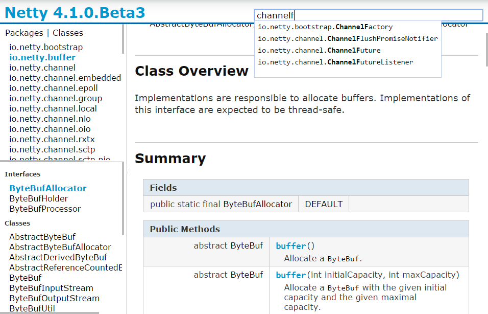

Doclava
=======

Doclava is a new javadoc doclet which is written by Google and used for Android Developer Docs. Clear and efficient(support search).

This project is forked from https://code.google.com/p/doclava/. Do some modification and make our own javadoc style.

## How to build
The [official site](https://code.google.com/p/doclava/) has binary downloads offered.

We use [Gradle](http://www.gradle.org/) to build this project.

<code>
gradle build
</code>

This will build a jar in build/libs which is the artifact.

Once you have the artifact, run `javadoc` command with the `-doclet` and `-docletpath`(if not in classpath) options to generate javadocs, for example:

<code>
javadoc -encoding UTF-8 -sourcepath src -d docs -subpackages project.package -doclet com.google.doclava.Doclava -docletpath doclava.jar -generatesources -project.name MyProject
</code>

More details please refer to [official site](https://code.google.com/p/doclava/).

Here is a screenshot

